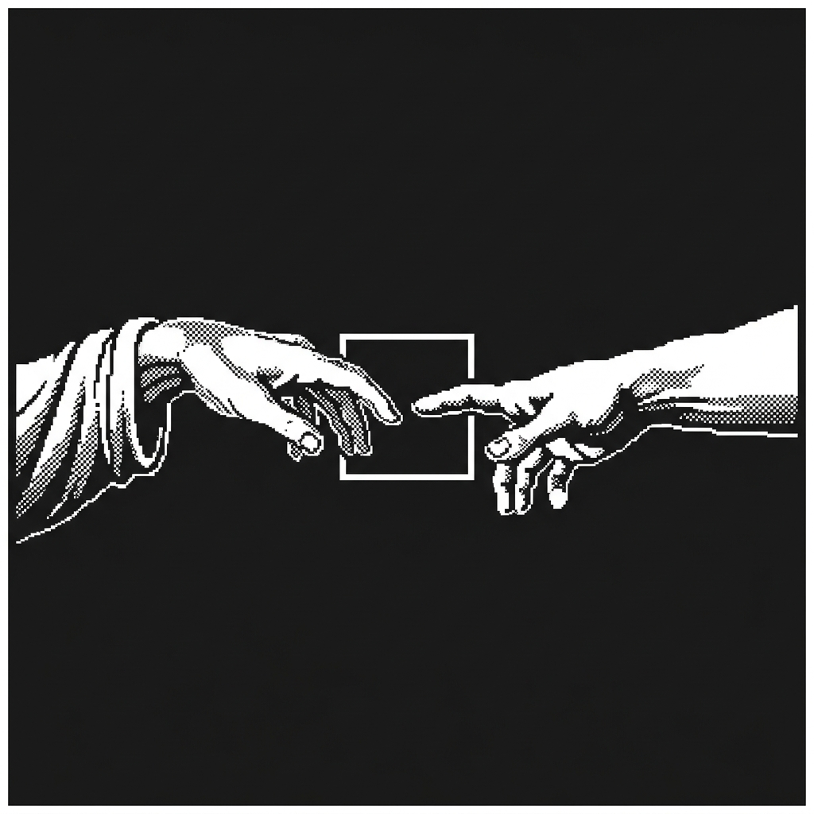

  
  
    

  # Hi 👋, Imma Shady

  ### Backend Developer

  <code>Just Code Nig</code>

   

  
Building reliable backend systems with clean architecture and scalable solutions.

---

## 
🚀 About Me

<table border="0" cellspacing="0" cellpadding="0">
  <tr>
    <td width="60%" valign="top">

**Shaddy, Here** — a final-year Computer Engineering student focused on backend development.

I enjoy building scalable, production-ready APIs with **Python** and continuously improving my understanding of real-world backend systems.

Currently, I'm learning **FastAPI**, **PostgreSQL**, **SQLAlchemy**, **Docker**, and **Redis**, while sharpening my problem-solving skills through **Data Structures & Algorithms**.

My goal is simple: write clean code, build reliable software, and grow into a software engineer who creates systems that last.

    </td>
    <td width="40%" align="center" valign="middle">
      
    </td>
  </tr>
</table>

---

## 
🤝 Connect

  
  &nbsp;&nbsp;
  
  &nbsp;&nbsp;
  

---

## 
💻 Tech Stack

  
    
  

---

## 
🎯 What I Build

- 🌐 **Full-Stack Web Applications**
- ⚙️ **RESTful APIs & Backend Services**
- 🗄️ **Database Design & Optimization**
- 🐳 **Containerized Applications with Docker**
- 📱 **Responsive Frontend Applications**
- 🚀 **Scalable System Architecture**

---

## 
📊 GitHub Stats

  

---

## 
📈 Activity Graph

  

---

## 
🐍 CONTRIBUTION SNAKE

  

---

  <h3>BUILD • LEARN • EXPERIMENT • REPEAT</h3>
  
⚡ Always learning. Always building.

  
📍 India | 🚀 Always learning & growing

 

